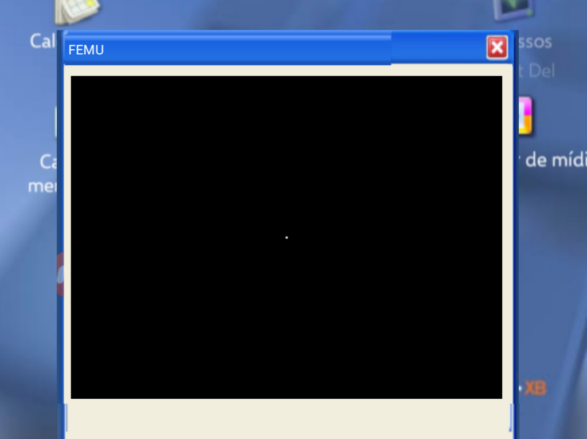

# Creating a Graphical User Interface (GUI)
In most modern systems, the GUI is essential.
Right now, in the middle of the Flamengo vs. PSG Intercontinental Cup soccer game, and as I'm writing this, there's a penalty shootout, we're going to teach you how to make a damn graphical interface.
A Graphical User Interface is basically a set of graphics that do not rely on text (such as ASCII characters). An example in Barassembly is:
```BSM
BITS16     ; initially defines 16 bits.
ORG 7C00   ; boot sector

_START:
  int 13 ; I don't know what to do.
  start int 62

.gui:
  draw_pixel 0x0, ex
  color_pixel 255255255, ex
  exib.graphical "Alanbus is here"

gui()

times ($-$$), 50
dw 33d4
```
`draw_pixel` draws pixels
`color_pixel` simply colors that pixel with a color.
I don't have idea more what I explain.
psg is chanpion nooooo I'am of Flamengo:(
Result (simulated):

